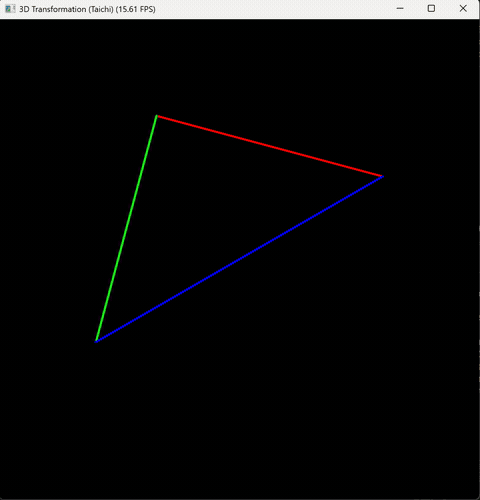

# 实验六：三维变换与 MVP 矩阵推导——线框三角形旋转

| 项目 | 内容 |
|------|------|
| **学号** | 202411081014 |
| **姓名** | 栾淇惠 |
| **专业** | 计算机科学与技术（师范） |

---

## 一、实验目标

- 深入理解三维空间中模型变换（Model）、视图变换（View）和投影变换（Projection）的数学本质与工程意义；
- 独立推导并实现绕 Z 轴旋转的模型矩阵、基于相机位置的视图矩阵以及透视投影矩阵；
- 掌握 Taichi 框架中的矩阵运算与齐次坐标操作，实现从三维顶点到二维屏幕坐标的完整渲染管线。

---

## 二、核心实现简述

**1. 模型变换（Model Matrix）**
实现 `get_model_matrix(angle)`，返回绕 Z 轴旋转角度 `angle`（角度制）的齐次变换矩阵。先将角度转为弧度，再利用标准旋转矩阵公式。该矩阵作用于初始三角形顶点，使其绕 Z 轴旋转，实现键盘 A/D 键控制。

**2. 视图变换（View Matrix）**
实现 `get_view_matrix(eye_pos)`，返回将相机从 `eye_pos` 平移到世界原点 `(0,0,0)` 的平移矩阵。由于相机默认朝向 -Z 方向，且无需旋转，视图矩阵即为平移矩阵的逆。

**3. 投影变换（Projection Matrix）**
实现 `get_projection_matrix(eye_fov, aspect_ratio, zNear, zFar)`，遵循透视投影标准推导流程：
- **透视→正交**：构造 `M_persp_to_ortho`，将视锥体挤压为长方体；
- **正交投影**：计算视锥体边界（`t = tan(fov/2)*|n|`, `b=-t`, `r=aspect*t`, `l=-r`），再构造 `M_ortho` 将长方体映射到 `[-1,1]^3` 的 NDC 空间；
- 最终投影矩阵为 `M_proj = M_ortho @ M_persp_to_ortho`。
注意：`zNear` 和 `zFar` 为正值距离，实际近截面 `n = -zNear`，远截面 `f = -zFar`；所有三角函数需先转弧度。

**4. 绘制流程**
对于每个顶点 `v`，依次应用模型、视图、投影矩阵（右乘顺序：`v_ndc = M_proj @ M_view @ M_model @ v`），得到齐次坐标 `(x,y,z,w)` 后执行**透视除法**（`x/w, y/w, z/w`）归一化至 NDC，再映射到屏幕像素坐标（窗口尺寸 700×700），最后用 `canvas.path` 绘制彩色线框三角形。

---

## 三、演示效果
> 展示内容：

> ① 初始状态下，三角形显示在屏幕中央（透视变形正确）；

> ② 按下键盘 `A` 键，三角形绕 Z 轴顺时针连续旋转；

> ③ 按下键盘 `D` 键，三角形绕 Z 轴逆时针连续旋转；

> ④ 按下 `Esc` 键程序正常退出。

---

## 四、实验总结

本次实验通过补全三个核心变换矩阵，完整实现了从三维顶点到二维屏幕的透视投影管线。关键收获如下：

- **矩阵推导**：加深了对齐次坐标与仿射变换的理解，尤其是透视投影中 `M_persp_to_ortho` 的推导（依赖相似三角形关系）以及正交投影的边界计算；
- **细节把控**：角度与弧度的转换、Z 轴符号处理（`n = -zNear`）以及透视除法是正确渲染的三大关键，稍有疏忽即导致图形错位或消失；
- **工程实践**：借助 Taichi 的 `ti.Matrix` 实现了高效的矩阵运算，并通过键盘事件实现实时交互，直观感受了 MVP 变换对三维物体显示的影响；
- **扩展思考**：本实验仅实现了绕 Z 轴的模型旋转，未来可扩展为任意轴旋转，并可加入相机自由移动功能，进一步体会视图变换的完整过程。