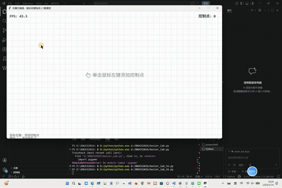

# 实验三：贝塞尔曲线交互绘制与光栅化实验报告

| 项目 | 内容 |
|------|------|
| **学号** | 202411081014 |
| **姓名** | 栾淇惠 |
| **专业** | 计算机科学与技术（师范） |

---

## 一、实验目标

- 理解贝塞尔曲线 (Bézier Curve) 的几何意义及 De Casteljau 递归插值算法；
- 掌握光栅化基础流程：将归一化浮点坐标映射至像素缓冲区 (Frame Buffer) 并直接点亮像素；
- 熟悉 Taichi 框架下的 GPU 并行计算，理解 CPU 与 GPU 之间的批量数据传输（Batching）机制；
- 实现基于鼠标点击添加控制点、键盘清空画布的实时图形交互系统。

---

## 二、核心实现简述

**1. De Casteljau 算法（CPU 端计算）**
编写纯 Python 函数 `de_casteljau(points, t)`，通过递归线性插值计算参数 $t \in [0, 1]$ 对应的曲线点坐标。主循环中对 1000 个采样点逐一计算，将所有坐标批量存入 NumPy 数组。

**2. GPU 并行绘制（光栅化）**
编写 `@ti.kernel` 并行内核 `draw_curve_kernel`，GPU 同时处理 1000 个像素点。将浮点坐标乘以屏幕尺寸（800x800）并转为整型索引，通过边界检查后直接修改 `pixels` 缓冲区对应位置的颜色值，极大提升绘制效率。

**3. 对象池技巧（避免动态内存分配）**
针对 GUI 控制点绘制，预先分配容量为 100 的固定显存池。未使用的控制点填充屏幕外坐标 `(-10.0, -10.0)`，仅将实际存在的控制点覆盖至数组前端，避免每次刷新时动态申请内存。

**4. 交互与清空逻辑**
- **鼠标左键点击**：获取窗口坐标，加入控制点列表（上限 100 个）。
- **键盘 `C` 键**：清空控制点列表，重置 `pixels` 缓冲区为初始背景色。
- **实时更新**：当控制点数量 ≥ 2 时，自动触发 CPU 计算、批量拷入 GPU 并调用绘制内核。

---

## 三、演示效果

> ① 鼠标连续点击添加红色控制点，灰色控制多边形随之变化；

> ② 绿色贝塞尔曲线随控制点移动（或新增点）实时动态更新；

> ③ 按下键盘 `C` 键后，所有控制点与曲线清空，画布恢复空白。

---

## 四、实验总结

本次实验成功实现了基于 De Casteljau 算法的贝塞尔曲线交互绘制系统。核心收获如下：

- **架构理解**：深刻认识到了 CPU 与 GPU 物理分离带来的通信瓶颈，通过“批量计算 + 一次性传输”替代“逐点提交”，有效避免了 PCIe 总线拥堵导致的卡顿。
- **工程技巧**：掌握了固定大小显存池（对象池）在动态交互场景中的复用方法，符合现代高性能渲染管线（如 Vulkan/Metal）的开发习惯。
- **功能完整性**：程序流畅实现了鼠标交互、实时光栅化绘制与一键重置功能，达到了预期的图形学实验教学目的。