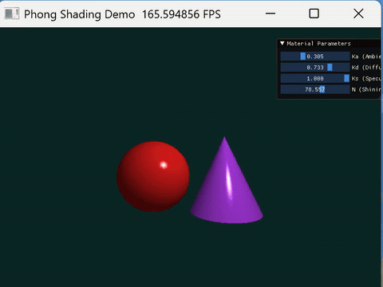

# 实验四：基于 Phong 光照模型的交互式渲染

| 项目 | 内容 |
|------|------|
| **学号** | 202411081014 |
| **姓名** | 栾淇惠 |
| **专业** | 计算机科学与技术（师范） |

---

## 一、实验目标

- 理解并掌握 Phong 局部光照模型的基本原理，区分环境光（Ambient）、漫反射（Diffuse）与镜面高光（Specular）的物理意义与数学表达；
- 熟练掌握三维空间中的向量运算，包括法向量计算、光线方向、视线方向及反射向量推导；
- 实践 Taichi 框架下的光线投射（Ray Casting）与实时交互渲染，通过 UI 滑块动态调节材质参数，直观感受各参数对成像效果的影响。

---

## 二、核心实现简述

**1. 隐式几何体光线求交与深度测试**
在 `@ti.kernel` 中为屏幕每个像素发射射线，分别计算与球体及圆锥的数学交点：
- **红色球体**（左）：圆心 `(-1.2, -0.2, 0)`，半径 1.2，利用球体方程 `|P - C|^2 = R^2` 求解二次方程根；
- **紫色圆锥**（右）：顶点 `(1.2, 1.2, 0)`，底面 `y = -1.4`，半径 1.2，利用圆锥隐式方程求交；
- **深度竞争（Z-buffer）**：若射线同时击中两物体，取最小正数 `t` 值的交点作为最近遮挡物，确保正确的前后遮挡关系，并在该点计算三维坐标与表面法向量 `N`。

**2. Phong 着色器计算**
在命中点处，计算光源方向 `L`、视线方向 `V` 及理想反射方向 `R`，按照 Phong 模型累加三个分量：
- **环境光**：`Ia = Ka * 光源颜色 * 物体颜色`；
- **漫反射**：`Id = Kd * max(0, N·L) * 光源颜色 * 物体颜色`（Lambert 余弦定律）；
- **镜面高光**：`Is = Ks * max(0, R·V)^Shininess * 光源颜色`。
将三者叠加作为最终像素输出，背景设为深青色。

**3. UI 实时交互面板**
利用 `ti.ui.Window` 创建滑动条控件，与着色器参数绑定，支持实时调节无需重新编译：
- `Ka`（环境光系数）：范围 0.0 ~ 1.0，默认 0.2；
- `Kd`（漫反射系数）：范围 0.0 ~ 1.0，默认 0.7；
- `Ks`（镜面高光系数）：范围 0.0 ~ 1.0，默认 0.5；
- `Shininess`（高光指数）：范围 1.0 ~ 128.0，默认 32.0。

---

## 三、演示效果

> ① 左右两侧红球与紫锥的静态渲染效果及正确遮挡关系；

> ② 拖动 `Ka`、`Kd`、`Ks` 滑块时，物体表面亮度与高光强度的连续变化；

> ③ 拖动 `Shininess` 滑块时，高光光斑由分散变锐利（或反之）的动态过程。

---

## 四、实验总结

本次实验基于 Taichi 实现了光线投射风格的 Phong 光照渲染器。核心要点总结如下：

- **数学应用**：强化了三维向量运算（点乘、反射向量推导）在图形学中的实际落地，并掌握了圆锥、球体等隐式曲面的解析求交方法；
- **性能优化**：得益于 `@ti.kernel` 的 GPU 并行特性，每个像素的光线求交与着色完全独立且并发执行，实现了实时交互调节；
- **工程实践**：通过 UI 控件动态绑定 `Ka/Kd/Ks/Shininess`，直观验证了环境光补光、漫反射基底亮度、高光强度与材质光泽度的物理关系，深刻体会到“材质参数调参”对画面真实感的决定性影响。