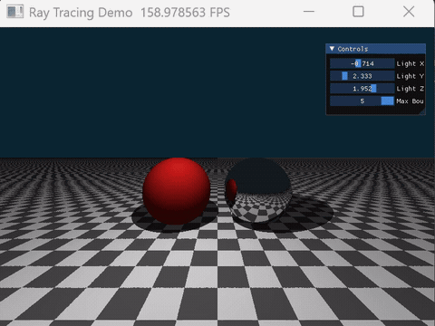

# 实验三：Whitted-Style 光线追踪——阴影与镜面反射

| 项目 | 内容 |
|------|------|
| **学号** | 202411081014 |
| **姓名** | 栾淇惠 |
| **专业** | 计算机科学与技术（师范） |

---

## 一、实验目标

- 理解光线投射（Ray Casting）与光线追踪（Ray Tracing）的本质区别，掌握 Whitted 风格光线追踪的递归思想；
- 掌握通过发射阴影射线（Shadow Ray）实现硬阴影，以及通过发射反射射线（Reflection Ray）实现镜面反射的全局光照技术；
- 掌握在 GPU 并行环境下将递归光线追踪改写为迭代循环的实现技巧。

---

## 二、核心实现简述

**1. 场景构建与材质系统**
在 `@ti.kernel` 中通过隐式方程定义场景，并为不同几何体分配材质 ID（漫反射 / 镜面反射）：
- **无限大地平面**（`y = -1.0`，法线朝上）：采用棋盘格纹理，通过交点 `(x, z)` 坐标的奇偶性判定黑白颜色，材质为漫反射；
- **红色漫反射球**（左，`(-1.5, 0.0, 0)`，半径 1.0）：基础漫反射材质；
- **银色镜面球**（右，`(1.5, 0.0, 0)`，半径 1.0）：纯镜面反射材质（反射率约 0.8）。

**2. 基于迭代的光线弹射（GPU 适配）**
由于 GPU 不擅长递归，将光线追踪路径写入 `for` 循环（最大弹射次数可由 UI 调节）：
- 维护 `throughput`（光线吞吐量，初始 1.0）和 `final_color`（最终累积颜色）；
- **镜面命中**：计算反射方向并更新光线起点，起点需沿法线外偏 `1e-4` 避免自交，`throughput` 乘以反射率，继续下一轮循环；
- **漫反射命中**：进行阴影测试，计算 Phong 漫反射与环境光，累加至 `final_color` 后终止该光线循环；
- 若未命中任何物体，将背景色乘以 `throughput` 累加后终止。

**3. 硬阴影与浮点精度修正**
在漫反射着色阶段，从交点向点光源发射阴影射线：
- **Shadow Acne 规避**：务必对阴影射线起点沿法线方向偏移微小量（`epsilon = 1e-4`），防止射线与自身几何体产生自相交，彻底避免画面出现大面积黑色噪点。

**4. UI 实时交互**
通过 `ti.ui.Window` 创建滑块控件，实时调控场景参数：
- **Light X / Y / Z**：动态移动点光源位置，观察阴影朝向与形状的实时变化；
- **Max Bounces**（范围 1~5，默认 3）：调节最大弹射次数，直观对比无反射（1 次）与出现镜面倒影（≥2 次）的视觉差异。

---

## 三、演示效果（GIF 占位）

> 展示：
> ① 整体场景：棋盘格地面、左侧漫反射红球、右侧镜面银球；

> ② 拖动 Light X/Y/Z 时，地面与红球上的阴影实时移动、拉伸的连续过程；

> ③ 调整 Max Bounces 从 1 到 3，右侧镜面球中逐步反射出红球与棋盘格画面的“镜中世界”效果。

---

## 四、实验总结

本次实验成功实现了基于 GPU 迭代的 Whitted 风格光线追踪渲染器。关键收获如下：

- **模型差异认知**：明确了光线投射（仅主光线）与光线追踪（次级光线递归/迭代）在全局光照表现上的根本区别；
- **GPU 编程思维**：学会了将递归逻辑手动展开为循环迭代，以适应大规模并行计算架构，并灵活运用 `throughput` 衰减系数控制能量守恒；
- **避坑经验**：深刻体会到浮点数精度问题（Shadow Acne）在图形学中的严重性，掌握了“起点沿法线外偏”这一通用工程解决方案；
- **交互验证**：通过 UI 实时调节光源与弹射次数，生动验证了光线追踪中“光线路径越深，画面信息越丰富”的物理规律。