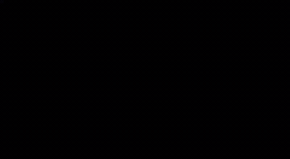

# 实验四：可微渲染与网格优化——从球体到奶牛

| 项目 | 内容 |
|------|------|
| **学号** | 202411081014 |
| **姓名** | 栾淇惠 |
| **专业** | 计算机科学与技术（师范） |

---

## 一、实验目标

- 理解可微光栅化的核心思想，特别是通过软光栅化（Soft Rasterization）解决离散边界处梯度消失问题；
- 掌握基于多视角二维剪影（Silhouette）监督信号，利用梯度下降优化三维网格顶点坐标的逆渲染流程；
- 深入理解正则化项（拉普拉斯平滑、边长惩罚、法线一致性）在网格优化中维持几何合理性的决定性作用。

---

## 二、核心实现简述

本实验在 **ModelScope** 平台上运行，利用 PyTorch3D 库搭建可微渲染管线，完成“球体→奶牛”的形变优化。

**1. 数据准备与场景配置**
- 加载目标奶牛网格（Target Mesh），在空间均匀设置 6~8 个摄像机视角，渲染出多张目标剪影图（二值掩码），作为监督标签；
- 初始化一个细分等级较高的球体网格（源模型），其顶点数量与目标网格相近，保证足够的形变自由度。

**2. 软光栅化（防梯度消失）**
采用 PyTorch3D 的 `SoftSilhouetteShader`，通过 Sigmoid 函数计算像素与三角形边界的概率隶属度：
$$A(d) = \text{sigmoid}(d / \sigma)$$
其中 $\sigma$ 控制边缘模糊程度（实验中设为 1e-4 量级）。该机制使远离边界的像素也能贡献微小梯度，引导顶点持续移动。

**3. 优化循环与损失函数**
将球体顶点的偏移量 `deform_verts` 设为可微参数（`requires_grad=True`），使用 Adam 优化器迭代更新。损失函数由三部分组成：
- **剪影 Loss**（`L_silhouette`）：渲染剪影与目标剪影的 MSE，为主监督信号；
- **正则化项**（以权重 $w_{lap}=0.1, w_{edge}=0.01, w_{normal}=0.01$ 组合）：
  - 拉普拉斯平滑：抑制顶点高频抖动，保持局部光滑；
  - 边长一致性：惩罚三角形边长过度拉伸或收缩；
  - 法线一致性：促使相邻面片法线方向趋同，避免“刺猬”状畸形。
总损失：$L_{total} = L_{silhouette} + w_{lap}L_{lap} + w_{edge}L_{edge} + w_{normal}L_{normal}$

**4. 迭代与可视化**
每 50 轮迭代导出当前网格渲染图，观察球体逐渐凹陷、拉伸，逐步逼近奶牛轮廓的过程。

---

## 三、演示效果

> 展示内容：
> ① 初始球体与目标奶牛网格的对比；

> ② 优化过程中不同迭代步数（如 0、50、100、200 轮）的网格形变状态；

> ③ 最终优化结果与目标网格的形状一致性对比

---

## 四、实验总结

本次实验借助 ModelScope 云端环境，成功完成了基于剪影监督的可微网格优化任务。核心收获如下：

- **梯度连续化**：深刻理解了软光栅化如何通过概率边界解决传统光栅化的不可微问题，使逆渲染成为可能；

- **工程体验**：熟悉了 PyTorch3D 的可微渲染管线，并利用 ModelScope 的预置环境免去了底层编译的繁琐，将精力集中于算法理解与参数调优。