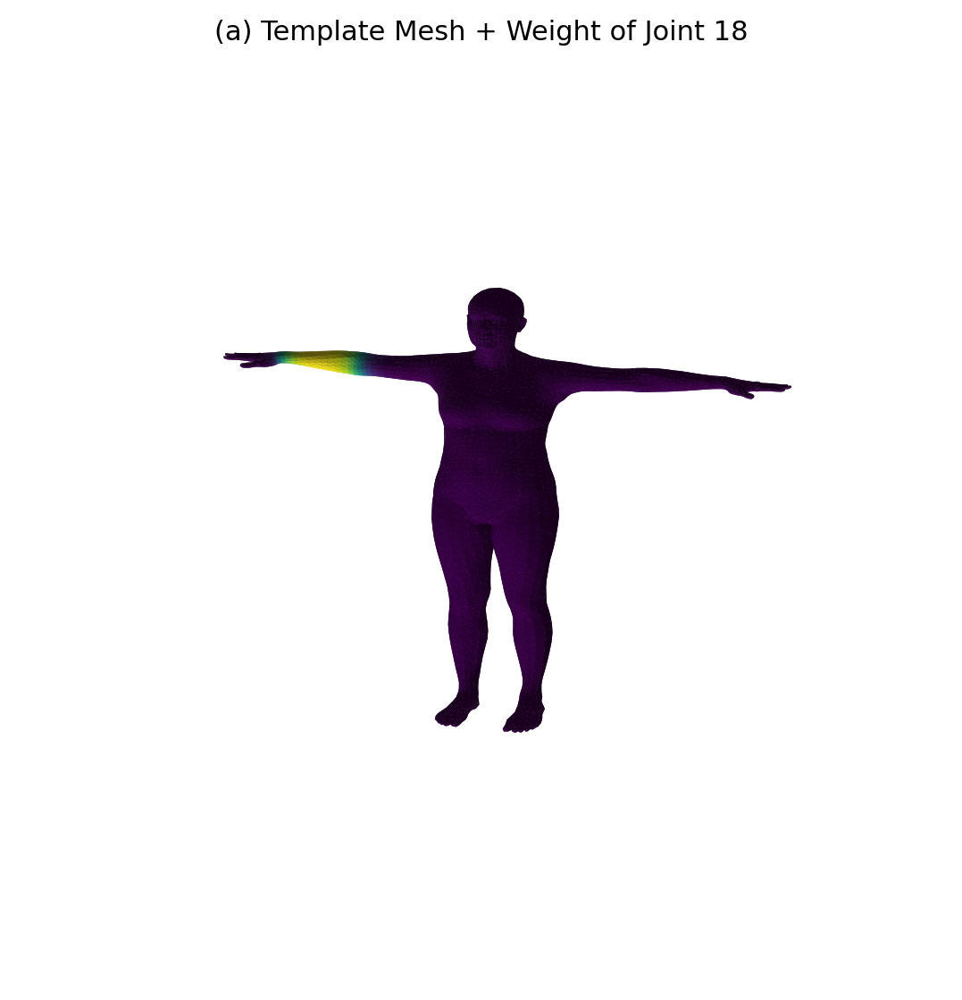
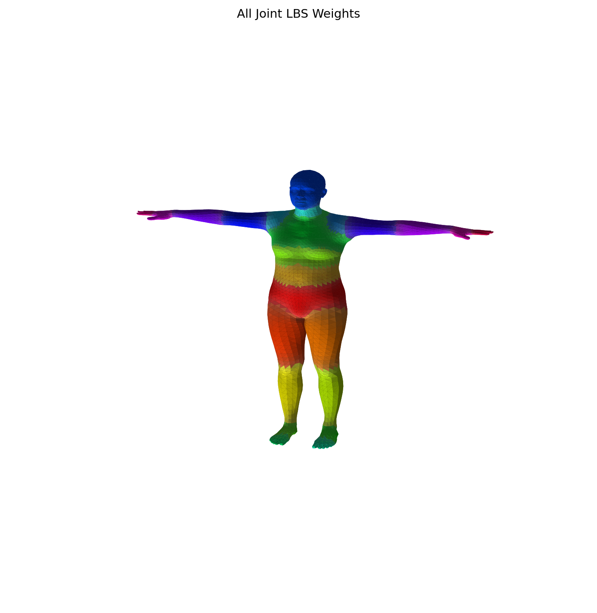
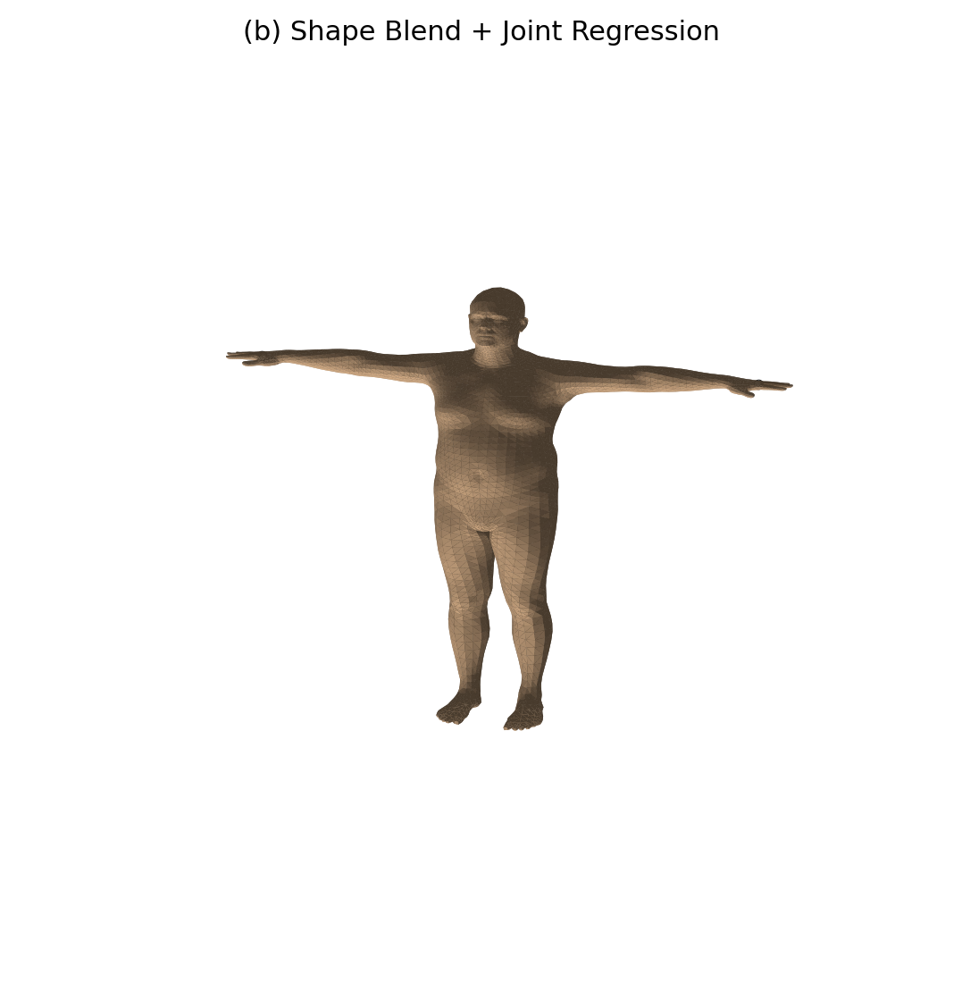
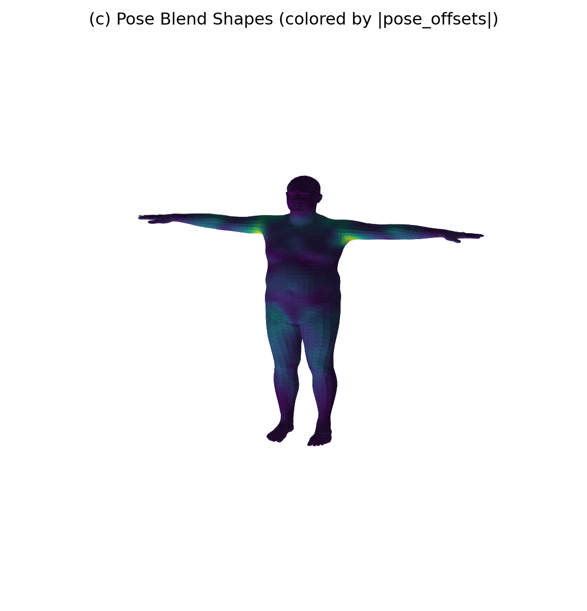
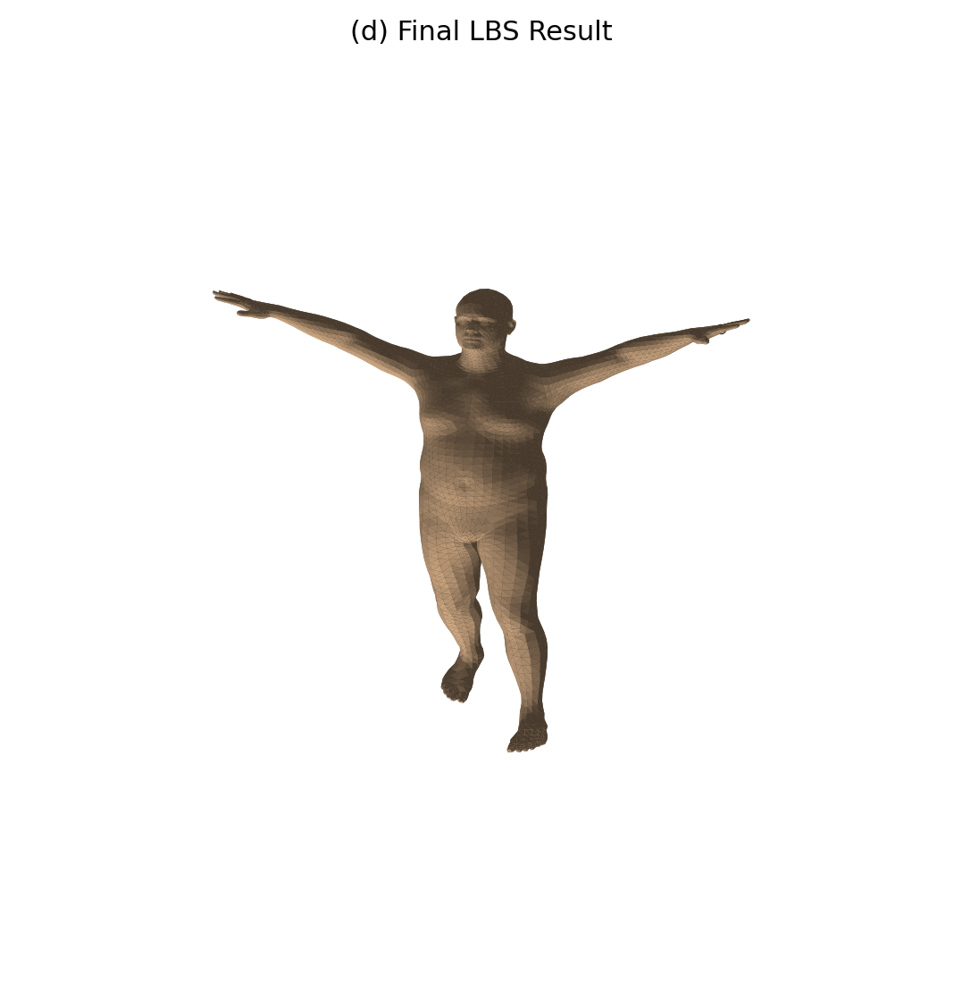
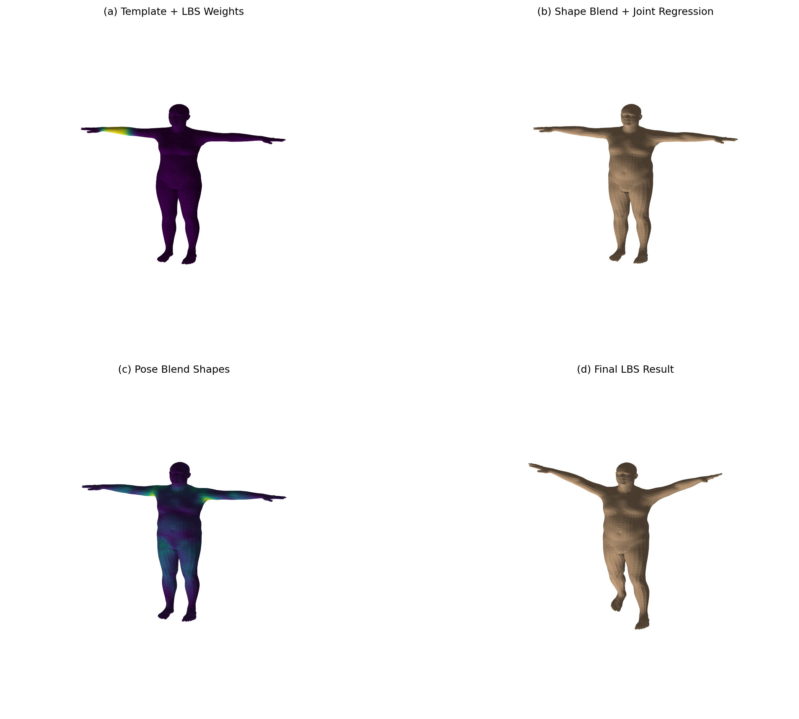

# 实验五：SMPL 参数化人体模型与 LBS 蒙皮可视化

| 项目 | 内容 |
|------|------|
| **学号** | 202411081014 |
| **姓名** | 栾淇惠 |
| **专业** | 计算机科学与技术（师范） |

---

## 一、实验目标

- 理解 SMPL 参数化人体模型的核心组成：模板网格、形状参数（β）、姿态参数（θ）、关节回归器（J_regressor）和蒙皮权重（lbs_weights）；
- 掌握线性混合蒙皮（Linear Blend Skinning, LBS）的完整四阶段流程：模板网格→形状校正→姿态校正→最终蒙皮；
- 实践使用 `smplx` 库加载 SMPL 模型，并分别提取和可视化 `v_template`、`v_shaped`、`J`、`v_posed`、`verts` 等关键中间变量；
- 通过手写 LBS 并与官方前向结果对比，验证对算法实现的正确性。

---

## 二、核心原理简述

SMPL 模型通过低维参数（形状 β 和姿态 θ）生成高精度人体网格。LBS 流程分为四个阶段：

1. **模板网格与权重**：固定 T‑pose 下的顶点 `v_template` 及每个顶点对各关节的蒙皮权重 `lbs_weights`（形状 `(6890, 24)`）。
2. **形状校正**：由 β 通过形状主成分（`shapedirs`）计算偏移 `B_S(β)`，得到 `v_shaped = v_template + B_S(β)`，再通过关节回归器计算关节位置 `J = J_regressor @ v_shaped`。
3. **姿态校正**：将轴角姿态 θ 转为旋转矩阵，构造 `pose_feature = R - I`，经 `posedirs` 线性映射得到 `B_P(θ)`，得到 `v_posed = v_shaped + B_P(θ)`，修正弯曲处的非刚体变形。
4. **线性混合蒙皮**：根据运动学链计算每个关节的全局变换矩阵 `G_k`，用蒙皮权重加权平均，得到最终顶点 `verts_i = Σ w_{ik} G_k · [v_posed_i; 1]`。

---

## 三、任务实现简述

**任务 1：模型加载与基础信息**
通过 `smplx.create(model_path='.', model_type='smpl', gender='neutral')` 加载 SMPL 模型。打印输出：
- 顶点数：6890
- 面片数：13776
- 关节数：24
- betas 维度：10

**任务 2：模板网格与单关节权重热力图**
从 `lbs_weights` 中取第 8 个关节（左肘，索引可自定义），将其对所有顶点的权重值映射为颜色，叠加在 `v_template` 上，输出 `stage_a_template_weights.png`。颜色越红表示该关节影响越大。同时可选生成 `all_joint_weights.png`，为每个面片分配主导关节的颜色，展示控制区域划分。

**任务 3：形状校正与关节回归**
设定 `betas` 前两个分量为 0.5 和 -0.5（分别对应胖瘦变化），计算 `v_shaped`，并使用 `J_regressor` 回归 `J`，将网格与关节点绘制于同一图中，输出 `stage_b_shaped_joints.png`。

**任务 4：姿态校正可视化**
设定 `global_orient` 与 `body_pose` 使手臂抬起（例如肘部弯曲），计算旋转矩阵并构造 `pose_feature`，得到 `pose_offsets`，将其 L2 范数映射为顶点颜色，输出 `stage_c_pose_offsets.png`，展示偏移主要集中在肘、肩等弯曲区域。

**任务 5：完整 LBS 最终结果**
根据运动学链计算关节全局变换 `G`，利用 `lbs_weights` 加权合成每个顶点的变换矩阵，得到 `verts`，绘制最终姿态网格及变换后的关节 `J_transformed`，输出 `stage_d_lbs_result.png`。

**任务 6：总对比图**
将前四个阶段的渲染图拼接成 2×2 网格，标注阶段标签，输出 `comparison_grid.png`。

**任务 7：手写 LBS 一致性验证**
在完全相同的 β 和 θ 下，用手写实现的 LBS（基于上述公式）与官方 `model.forward()` 结果对比，计算：
- 平均绝对误差（MAE）
- 最大绝对误差（MAX）
确保误差量级在 1e-6 左右（数值误差），并将结果写入 `summary.txt`。

---

## 四、演示效果

> 展示内容：

> ① 阶段 (a) 模板网格 + 单关节权重热力图（以及可选的全关节主导图）；

> ② 阶段 (b) 体型变化后的网格及回归出的关节点；

> ③ 阶段 (c) 姿态校正偏移量在网格上的颜色映射；

> ④ 阶段 (d) 最终 LBS 蒙皮后的姿态及关节位置；

> ⑤ 四个阶段的组合对比图。

---

## 五、实验总结

本次实验深入拆解了 SMPL 模型的 LBS 流程，亲手可视化每个阶段的中间产物，获得以下核心认知：

- **解耦设计**：形状和姿态独立控制，通过线性叠加的混合形状（blend shapes）和蒙皮权重实现了低维参数对高维网格的有效驱动；
- **正则化必要性**：姿态校正项 `B_P(θ)` 修正了简单线性蒙皮无法表达的非刚体形变，显著提升了弯曲处的真实感；
- **权重分布影响**：顶点若仅受单关节影响会导致皮肤破裂，若平均分配则蒙皮过软，SMPL 学习的权重分布在保持刚体区域的同时允许关节过渡区平滑混合；
- **一致验证**：手写 LBS 与官方实现误差在浮点精度范围内，证明算法理解正确。该实验为后续动画、拟合乃至可微渲染等任务奠定了坚实基础。